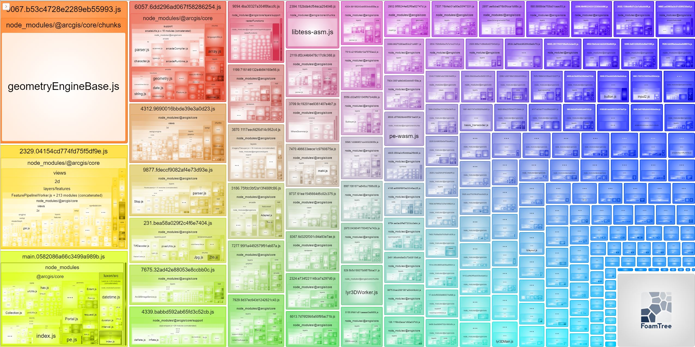

# `@arcgis/core` Treeshaking Issue

## Getting Started
Fork this repository and clone your fork to your computer, from the project's root directory, install the required packages (dependencies):

```sh
npm install
```

To run and test the app on your local machine (http://localhost:8080):

```sh
# it will start a server instance and begin listening for connections from localhost on port 8080
npm run start
```

To build/deploye the app, you can run:

```sh
# it will place all files needed for deployment into the /dist directory 
npm run build
```

## Reproduce the Treeshaking Issue 
Open the [`/src/index.tsx`](./src/index.tsx) file, you'll notice that only the Portal module from `@arcgis/code` is explicitly included:

```js
// import OAuthInfo from '@arcgis/core/identity/OAuthInfo';
// import esriId from '@arcgis/core/identity/IdentityManager';
import Portal from '@arcgis/core/portal/Portal';
// import Credential from '@arcgis/core/identity/Credential';
// import PortalUser from '@arcgis/core/portal/PortalUser';

console.log(
    // OAuthInfo,
    // esriId,
    Portal,
    // Credential,
    // PortalUser
)
```

However, upon running `npm run build`, you may observe that numerous modules (e.g. `geometryEngineBase.js`) are retained in the compiled files despite the expectation that they would be removed by the tree shaking process.



Here is the [`webpack.config.js`](./webpack.config.js) that I use:

```js
const path = require('path');
const package = require('./package.json');
const HtmlWebpackPlugin = require("html-webpack-plugin");
const ForkTsCheckerWebpackPlugin = require('fork-ts-checker-webpack-plugin');
const BundleAnalyzerPlugin = require('webpack-bundle-analyzer').BundleAnalyzerPlugin;

module.exports =  (env, options)=> {

    const devMode = options.mode === 'development' ? true : false;

    process.env.NODE_ENV = options.mode;

    return {
        mode: options.mode,
        entry: path.resolve(__dirname, './src/index.tsx'),
        output: {
            path: path.resolve(__dirname, './dist'),
            filename: '[name].[contenthash].js',
            chunkFilename: '[name].[contenthash].js',
            clean: true
        },
        devtool: 'source-map',
        resolve: {
            extensions: ['.js', '.jsx', '.json', '.ts', '.tsx'],
        },
        module: {
            rules: [
                {
                    test: /\.(ts|tsx)$/,
                    loader: 'babel-loader'
                },
            ]
        },
        plugins: [
            // need to use ForkTsCheckerWebpackPlugin because Babel loader ignores the compilation errors for Typescript
            new ForkTsCheckerWebpackPlugin(),
            new HtmlWebpackPlugin({
                template: './public/index.html',
                filename: 'index.html',
                title: package.name,
            }),
            !devMode ? new BundleAnalyzerPlugin() : false
        ].filter(Boolean),
        optimization: {
            // splitChunks: {
            //     cacheGroups: {
            //         // vendor chunk
            //         vendor: {
            //             // sync + async chunks
            //             chunks: 'all',
            //             name: 'vendor',
            //             // import file path containing node_modules
            //             test: /node_modules/
            //         }
            //     }
            // },
            // minimizer: [
            //     new TerserPlugin({
            //         extractComments: true,
            //         terserOptions: {
            //             compress: {
            //                 // drop_console: true,
            //             }
            //         }
            //     }), 
            // ]
        },
    }
};
```